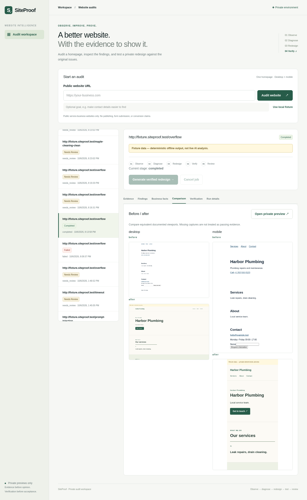
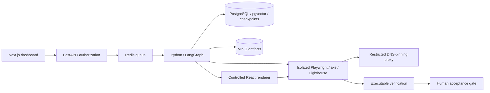

# SiteProof

[](https://github.com/demis1997/siteproof/actions/workflows/ci.yml)

A homepage audit and private redesign system that tests whether a redesign fixes the problems it identified. Findings link to inspectable evidence; failed or missing required checks prevent acceptance.



*Captured from the local application with a labelled fixture provider and synthetic service business. This demonstrates rendering and verification, not live model quality.*

## Implemented capabilities

- Desktop/mobile Playwright capture, DOM geometry, axe and repeated Lighthouse checks.
- Typed findings with validated evidence references; approved business facts with source/capture provenance.
- Separate facts and guidance collections; PostgreSQL full-text/vector retrieval, reciprocal rank fusion, tenant filtering and content-hash caching.
- Three bounded LangGraph roles: Auditor, Designer and Verifier; PostgreSQL checkpoints and durable step journals.
- Controlled React specifications, authenticated noindex previews, maximum two repairs and explicit human acceptance.
- Tenant-owned jobs/artifacts, SSRF protections, DNS-pinning proxy, browser network isolation, cancellation and budgets.



## No-key fixture demo

Requires Docker Compose and network access for dependency/image downloads. Run from this repository root:

```sh
test -f .env || cp .env.example .env
docker compose --env-file .env -f infra/compose.yaml -f infra/compose.integration.yaml --profile integration -p siteproof-integration up -d --build
curl http://localhost:8000/health
curl http://localhost:8000/ready
```

Open http://localhost:3000, sign in with `integration-key` (a public local test credential), and submit `http://fixture.siteproof.test/overflow`. Inspect both viewports, approve findings/facts, request a redesign and review its verification. Fixture labels remain visible. Only passing checks permit acceptance.

The integration override explicitly clears provider credentials even if the private root `.env` is live. Run one stack at a time on these ports. Its exact-host fixture exception is for controlled testing; do not expose this profile publicly.

```sh
docker compose --env-file .env -f infra/compose.yaml -f infra/compose.integration.yaml --profile integration -p siteproof-integration down
```

Volumes persist; `down -v` deletes data. See the [demo script](docs/DEMO.md) and [full stack commands](docs/PHASE34.md).

## Checks and observed results

Python 3.12 and Node.js 22.20+:

```sh
python3.12 -m venv .venv
. .venv/bin/activate
pip install -r requirements.lock
ruff check services evals
pytest
python evals/run.py
npm ci --prefix apps/web
npm run lint --prefix apps/web
npm run typecheck --prefix apps/web
npm run build --prefix apps/web
# With the fixture stack running:
python evals/stack_run.py
python evals/phase34_run.py
python evals/regression_gate.py
python evals/phase34_recovery.py
python evals/phase34_ui_run.py
```

The [validated implementation CI run](https://github.com/demis1997/siteproof/actions/runs/37531750994) passed backend, frontend, browser-slice and real-stack jobs. Recorded checks include 138 Python tests, four renderer tests, two Lighthouse samples per viewport before/after, regression rejection, two-repair exhaustion, real worker SIGKILL recovery and private-preview UI checks. These are linked historical observations, not guaranteed future CI outcomes.

The [fixture report](evals/reports/phase34/report.md) records one normal redesign and three concurrent development audits: **3/3 completed**, queue-inclusive p50 **88.18s**, p95 **130.27s**; one worker, browser/domain limit one, macOS ARM host, Docker 14 CPUs / approximately 8 GB RAM. This is a small synthetic sample, **not a production load benchmark**. Development category counts were 1 TP / 0 FP / 0 FN across three pages. Labels are agent-authored and pending independent review; the preserved historical test group was used in earlier milestones and is not independently unseen.

## Validation boundaries

**Real-stack fixture validation:** capture, redesign, verification, recovery and UI passed the linked checks.

**Live AI: BLOCKED.** Live vision/text and embedding paths are implemented, but zero OpenAI balance stopped validation. No successful live vision/text audit or real-embedding comparison establishes quality. Live model quality, semantic retrieval and actual inference costs remain blocked. Synthetic vectors test retrieval mechanics only. Existing validation reservations are preserved; live jobs never silently switch to fixtures.

**Unresolved:** one of two development no-answer queries returned irrelevant keyword guidance. The [diagnosis](evals/reports/phase34/no-answer-development.md) records this failure without tuning held-out labels. Independent human design review remains pending.

## Decisions and security

Constrained components prevent arbitrary model-generated code and dependencies. PostgreSQL combines tenant-owned facts, hybrid retrieval and checkpoints without a second search service. Executable failures cannot be waived by model opinion; passing checks still require human acceptance.

Scope is one public English-language service-business homepage, without login or publishing. Approved contact facts are preserved. Automated checks do not prove WCAG compliance, conversion gains or production scalability. Link checks cover homepage fragments only. Public-site network performance and isolated preview performance are different measurement environments.

Read [architecture](docs/ARCHITECTURE.md), [security](docs/SECURITY.md), [API](docs/API.md), [providers](docs/PROVIDERS.md), [evaluation](docs/EVALUATION.md), [deployment](docs/DEPLOYMENT.md), [final status](docs/PHASE34_FINAL_STATUS.md), and [future live commands](docs/LIVE_BENCHMARK_LATER.md). Earlier useful operational notes remain in the [previous README](docs/README_LEGACY.md).
