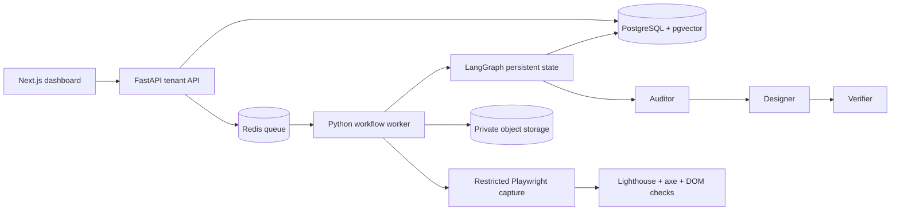

# Architecture and boundaries

The three bounded application roles are Auditor, Designer, and Verifier. Capture, retrieval, rendering, and check evaluation are deterministic tools. Website content is untrusted data, never instructions. A maximum of two repairs prevents indefinite loops; inconclusive checks require review.

The first version uses a typed page specification and approved components because unrestricted generated code adds dependency, execution, and secret-exfiltration risks. PostgreSQL owns tenant data, text search, vectors, and checkpoints to avoid another retrieval service. Text and vector ranks can be merged through reciprocal rank fusion; embedding versions and content hashes must invalidate cached representations.

Business facts and guidance have separate provenance. Website facts require capture evidence; curated guidance has source, version, retrieval date, and reuse notes. Local guidance is explicitly labelled as a sample.

The reference deployment is one host. Redis queue consumers could be replicated with shared storage and database-backed leases, but scaling claims require load tests. Tenant and domain admission limits prevent queue concurrency from bypassing browser limits.
